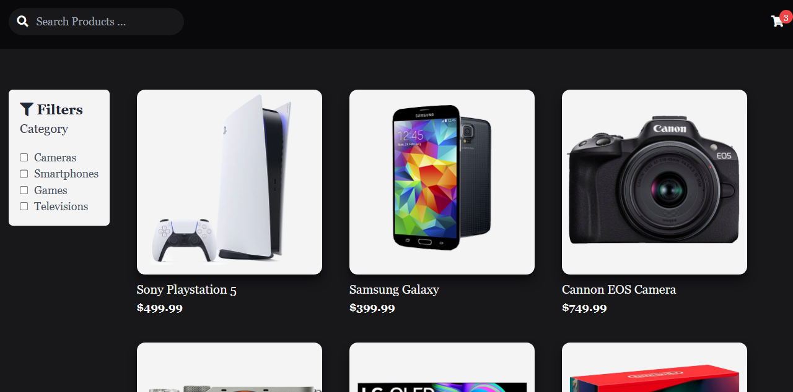

# Tech Store

Tech Store is a product website that allows users to browse and filter products by category. It also includes a shopping cart functionality.

## App interface


## Features

- Product filtering: Users can filter products by category using checkboxes.
- Search: Users can search for products using the search bar.
- Shopping cart: Users can add products to their shopping cart.

## Technologies Used

- HTML5
- CSS3 (with Tailwind CSS for styling)
- JavaScript

## Setup

To run this project, you will need to:

1. Clone the repository to your local machine.
```bash
git clone https://github.com/Umairulislam/Tech-Store.git
```
2. Open the `index.html` file in your browser.

## Usage

- Use the checkboxes to filter products by category.
- Use the search bar to find specific products.
- Click on the shopping cart icon to view your cart.
